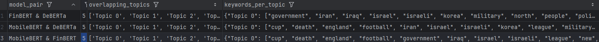
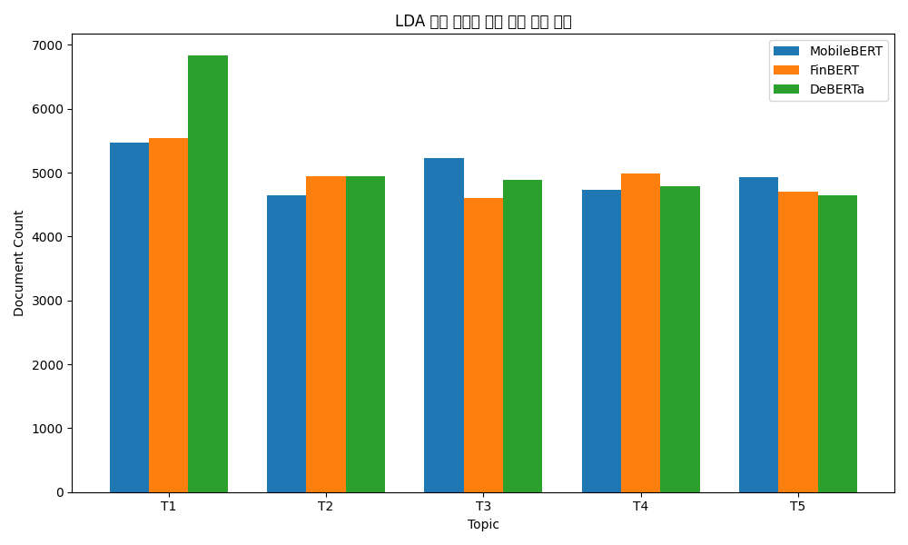

 

## 📌 1. 프로젝트 개요

금융 뉴스 헤드라인을 보고 감정을 분류하는 모델을 만들어보자는 아이디어로 프로젝트를 시작했다.  
처음에는 약 10만 개의 원본 데이터를 기반으로 모델을 학습하고 평가할 계획이었지만,  
실제로 데이터를 살펴보니 문장 품질이나 라벨 정합성이 너무 낮아, 이걸 그대로 사용할 수는 없다고 판단했다.

그래서 원본 데이터를 신뢰할 수 없다고 판단하고,  
**내가 직접 문장을 수집하고 라벨링하는 방식으로 방향을 전환**했다.  
최종적으로 **총 3,300개의 뉴스 헤드라인을 수집**하고,  
**부정(0), 긍정(1), 중립(2)** 세 클래스로 **수작업 라벨링을 진행**했다.

감정 판단 기준은 단순 키워드가 아니라 **금융적인 맥락과 문장 흐름**을 중심으로 잡았으며,  
클래스 간 데이터 불균형이 없도록 **세 클래스를 균형 있게 구성**했다.

이후, **이렇게 학습된 모델을 이용해 원본 데이터를 다시 평가**해보기로 했다.  
그 과정에서 **직접 라벨링한 3클래스 데이터에서 중립(2)을 제외한 0/1 데이터만으로 MobileBERT를 학습**한 뒤,  
30k 슬라이싱 원본 데이터에 예측을 수행해보았다.  
그 결과, validation 기준으로는 **92%의 높은 정확도**를 보였지만,  
중립이 포함된 실제 원본 데이터셋에서는 **정확도가 27%로 급락**했다.  
이 실험을 통해, **중립 클래스를 제거하면 모델이 감정 판단 기준 자체를 상실**하고,  
현실 데이터를 해석하지 못한다는 결론에 도달했다.

그 후 이 데이터를 바탕으로,  
MobileBERT, FinBERT, DeBERTa 세 가지 BERT 계열 모델을 fine-tuning 하고  
직접 라벨링한 데이터셋에 대한 성능을 비교 평가했다.

마지막으로, 모델이 자주 틀리는 문장들을 모아 원본 데이터셋이 틀린 것이   
각각의 모델들이 틀린 토픽들과 연관성이 있는지   
역추적하기 위해 BERTopic 기반 토픽 모델링을 수행했다.  
이 과정을 통해 모델이 어려워하는 토픽과 모델별 성향 차이를 파악하고,  
뉴스 데이터에서 감정 인식이 까다로운 주제들이 무엇인지 정성적으로 분석할 수 있었다.

## 📌 2. 데이터 라벨링 기준 및 직접 라벨링한 데이터 구성

원본 데이터를 분석해보면서 라벨이 너무 믿기 어렵다고 판단한 이후,  
아예 내가 직접 데이터를 라벨링하는 방식으로 방향을 바꿨다.  
처음엔 귀찮고 시간이 오래 걸릴 것 같아서 고민도 했지만,  
결국 좋은 모델을 만들려면 정확한 기준으로 만들어진 데이터가 중요하다고 판단해서 수작업 라벨링을 진행했다.

총 약 **3,300개의 문장**을 라벨링했고, 감정은 **부정(0), 긍정(1), 중립(2)** 이렇게 세 가지 클래스(Class)로 나눴다.

### 🔹 라벨링 기준

- **0 (부정)**  
  주가 하락, 실적 악화, 구조조정, 법적 리스크 등 부정적 뉴스  
  예: 
`"국제 전자 산업 회사 엘코텍은 탈린 시설에서 수십 명의 직원을 해고했으며"`
`"영업 손실은 총 0.3백만 유로로 2007년 같은 기간의 220만 유로 이익에 비해 크게 증가했습니다."`

- **1 (긍정)**  
  주가 상승 기대, 실적 개선, 투자 유치, 낙관적 전망 등 긍정적 뉴스  
  예: `"테슬라, 전기차 배터리 수주 대폭 확대"` 
  `"새로운 생산 공장을 통해 회사는 예상되는 수요 증가를 충족할 수 있는"`

- **2 (중립)**  
  감정이 없는 단순 사실 전달 또는 판단이 애매한 경우  
  예: `"NVIDIA 주가 변동폭 커"`, `"이번 거래는 경직된 플라스틱 소비재 운영에 대한 허타마키의 전략적 검토를 뒷받침합니다."라고 허탐+횈키 오이지의 CEO인 죽카 모이시오(Jukka Moisio)는 말합니다"`

### 🔹 라벨링 시 고려한 점

- 단어 위주 판단이 아닌 **문맥과 금융적 의미** 중심으로 분류했음(중립처리 때문임.)
- 긍/부정이 아닌 정보만을 나열하거나 애매한 문장은 **중립** 처리했음. 
- 스스로 기준이 흔들리지 않게 중간중간 **기준 점검했음.**

- ### 🔹 라벨 분포 요약

| 라벨 | 의미   | 개수 (대략) |
|------|--------|-------------|
| 0    | 부정   | 약 1,100건   |
| 1    | 긍정   | 약 1,100건   |
| 2    | 중립   | 약 1,100건   |

> ⚖️ 클래스 밸런스를 최대한 맞춰서 모델이 편향 없이 학습되도록 구성함

---
##  📊 모델 성능 비교
### ⚠️ 초기 중립 제거 모델 성능 비교

아래는 **중립 클래스를 제거한 0/1 이진 분류 MobileBERT 모델**이  
직접 라벨링한 데이터(Validation)와 **원본 슬라이싱 데이터(30k)**에서 각각 얼마나 성능을 보였는지를 비교한 표이다.

| Model                      | Val Accuracy (직접 라벨링 데이터) | Accuracy (원본 30k 데이터 평가) |
|----------------------------|------------------------|--------------------------|
| MobileBERT (중립 제거 후 만든 모델) | **약 91%**              | **약 27%**             |

> ⚠️ *Validation에서는 높은 성능을 보였지만, 실제 중립이 포함된 현실 데이터에 대해선 극단적으로 낮은 성능을 보이며,  
> 중립 제거 방식이 실전에서는 부적절하다는 것을 보여주는 중요한 실험 결과를 알 수 있었다.*

---
### 현재 사용 모델:

| Model     | Val Accuracy |
|-----------|--------------|
| MobileBERT | 85.63%       |
| FinBERT    | 86.28%       |
| DeBERTa    | 88.05%       |

> ✅ *DeBERTa가 가장 높은 정확도를 보였으며, 세 모델 간 성능 차이는 크지 않지만 미세한 차이가 존재함.*
---

## 📌 4. 슬라이싱 데이터 재라벨링 및 정합성 평가

슬라이싱한 약 30,000개의 원본 데이터를 대상으로, 학습된 모델(MobileBERT, FinBERT, DeBERTa)로 예측을 수행했다.  

---

### 🧩 모델별 "중립" 분류 비율 차이

| Model     | 전체 예측 수 | 중립으로 분류된 수 | 중립 비율 (%) |
|-----------|---------------|----------------------|----------------|
| MobileBERT | 약 30,000     | 20,529               | 68.43%         |
| FinBERT    | 약 30,000     | 22,900               | 76.33%         |
| DeBERTa    | 약 30,000     | 20,102               | 67.01%         |

> 📌 *중립 라벨을 가장 많이 예측한 모델은 FinBERT였고, 반대로 MobileBERT와 DeBERTa는 상대적으로 중립 비율이 낮았다.*
.

---

### 📊 중립 제거 후 2진 분류 정합성 평가 (원본 라벨 기준 Accuracy)

중립(2)으로 분류된 행을 제거하고 남은 긍정/부정 예측 결과만을,  
기존 원본 라벨과 비교해 Accuracy를 측정했다.

| Model     | Accuracy (중립 제외 후) | 평가 샘플 수 |
|-----------|--------------------------|---------------|
| MobileBERT | 52.70%                   | 9,471         |
| FinBERT    | 54.96%                   | 7,100         |
| DeBERTa    | 52.94%                   | 9,898         |

> ⚠️ *모델 성능이 낮다기보다, 원본 라벨과 모델 간 기준 차이가 많이 나고 원본 데이터셋이 좋지않음을 알 수 있음.*

---

지금까지 살펴본 표들을 보면, **중립 클래스를 제거한 모델이 현실에서 어떻게 실패하는지를** 확인할 수 있습니다.

먼저, 초기 실험에서는 **중립을 제거한 상태로 직접 라벨링한 0/1 데이터만을 사용해 MobileBERT를 학습**했습니다.  
이 모델은 validation 기준으로는 약 **91%의 정확도**를 보이며 굉장히 좋아 보였지만,  
실제로 **중립이 포함된 원본 데이터셋(슬라이싱 30k)** 에 적용해보니 정확도가 **단 27%**밖에 나오지 않았습니다.

이건 단순히 모델이 못 만든 게 아니라,  
**학습 당시 중립이라는 감정 판단 기준 자체가 사라졌기 때문**입니다.  
즉, 모델은 애초에 **중립이라는 선택지를 배운 적이 없기 때문에**,  
**현실 데이터를 해석할 능력도 없었던 것**입니다.  
이 실험을 통해 **중립 제거 방식은 실전 투입에 적합하지 않다는 명확한 증거**를 얻을 수 있었습니다.

---

그래서 방향을 바꿨습니다.  
**중립을 포함한 수작업 라벨링(3클래스)** 을 기반으로 MobileBERT, FinBERT, DeBERTa 세 모델을 새롭게 학습했고,  
그 결과 **현재의 모델은 약 85~88% 수준의 validation 정확도**를 기록했습니다.

---

다음으로, 이렇게 학습한 모델들을 활용해 **원본 30k 데이터에 대한 예측을 수행**하고,  
그중 **중립(2)** 으로 분류된 데이터는 제외한 뒤,  
남은 **긍/부정(0/1)** 결과만을 **원래 원본 라벨과 비교**해보았습니다.

여기서 흥미로운 현상이 나타났습니다.  
**모델별로 중립으로 분류한 비율이 크게 달랐고**,  
**중립 제외 후 비교 가능한 샘플 수에도 차이**가 났습니다.  
예를 들어, **FinBERT는 중립으로 76%를 분류해서 가장 보수적인 판단**을 보였고,  
**DeBERTa는 67% 정도로 중립을 상대적으로 덜 예측**했습니다.

---

이 차이는 **모델이 감정을 판단할 때의 민감도 차이**를 보여줍니다.  
특히 **FinBERT는 금융 특화 모델이라 더 조심스럽게 감정을 판단**하는 경향이 있었고,  
**MobileBERT는 구조상 모호한 문장도 긍/부정 중 하나로 쉽게 판단**해버리는 성향을 보였습니다.

---

마지막으로 **중립을 제외한 상태에서 0/1 정합성 평가(Accuracy)를 수행**했을 때,  
세 모델 모두 **52~55% 정도의 낮은 정확도**를 보였습니다.  
이건 두 가지 의미를 가집니다:

1. **원본 라벨 자체가 완전히 신뢰하기 어렵다는 사실**
2. **중립이라는 클래스가 얼마나 중요한지를 다시 확인할 수 있는 근거**

---

---

## 📌 6. 오류 분석 및 토픽 모델링

### 🎯 분석 목적

앞선 평가에서 세 모델(MobileBERT, FinBERT, DeBERTa)은 validation 정확도가 85%를 넘었음에도 불구하고,  
원본 데이터에선 52~55% 수준의 낮은 성능을 보였습니다.  
그렇다면 **나머지 15%의 오답은 어떤 유형의 문장에서 발생하는가?**,  
그리고 **특정 모델이 consistently 실패하는 문장은 어떤 주제를 갖는가?**를 확인하기 위해  
**오답 데이터를 모아 토픽 모델링**을 수행했습니다.

> 목적: "모델이 어려워하는 문장들의 토픽이 원본데이터에 토픽에 비중이 크기때문에   
> 원본 데이터에 대한 성능이 낮은게 아닐까?" 라는 궁금증을 해결해기 위해서   
> 원본 데이터의 특성과 어떤 연관이 있는지 분석.

---

### 🛠️ 분석 방법

- 모델별로 3클래스(0/1/2) 분류 결과 중 **예측이 틀린 문장 전체를 수집**
- 수집한 오답 데이터를 대상으로 **BERTopic** 기반 토픽 모델링 진행
- 토픽별 대표 키워드 및 문장 예시 추출
- 시각화 자료와 비교하여 **모델별 에러 발생 패턴 확인**

사용 시각화 자료:
- `top10_barchart.html`: 각 모델별 Top-10 토픽 시각화
- `topic_clusters.html`: 전체 에러 토픽 클러스터 시각화
- `topic_headmap.html`: 토픽 간 유사도 히트맵
- `topic_keywords.csv`: 모델별 토픽 대표 키워드

---

### 📊 모델별 주요 에러 토픽 (Top-3 예시)

| Model      | 주요 에러 토픽 키워드 예시                                                                                     |
|------------|-----------------------------------------------------------------------------------------------------|
| MobileBERT | `world`, `company`, `000`,` million`,    ` years`,` time`,` obituary`,` new`,` group`,` year`   |             |
| FinBERT    | ` new`,` football`,` england`,` cup`,    ` world`,` league`,` leader`,` rugby`,` union`,` says` |
| DeBERTa    | `israel`,` says`,` police`,` israeli`,    ` iran`,` north`,` korea`,` year`,` military`,` years`     |

> 📌 *MobileBERT는 `obituary`, `group`, `time` 등 일반 시사나 사망 기사처럼  
> 금융 감정과 직접적 관련이 없는 **비재무적 일반 뉴스**에서 오답이 많았고,*  
> *FinBERT는 `football`, `rugby`, `cup` 등의 **스포츠/이벤트성 기사**에서 감정 판단이 흔들렸으며,*  
> *DeBERTa는 `israel`, `iran`, `military`, `korea` 등 **국제 정치/안보 관련 뉴스**에 대한 분류에서  
> 혼란을 겪는 경향이 나타났다.*

---

### 🔄 교차 비교: 공통적으로 어려워한 토픽

### 📌 모델 간 공통 에러 토픽 분석

BERTopic 기반으로 모델 간 오답 토픽의 교집합을 추출한 결과,  
다음과 같은 키워드들이 반복적으로 등장했다:

- `football`, `cup`, `rugby`, `league` 등 **스포츠 관련 키워드**
- `obituary`, `death`, `old`, `children`, `year`, `time` 등 **비즈니스와 직접 관련 없는 일반 시사 키워드**
- `israel`, `iran`, `korea`, `military`, `police`, `war` 등 **국제 분쟁 및 정치·안보 관련 키워드**
- `company`, `000`, `million`, `china`, `japan`, `gaza` 등 **국가 및 기업 키워드가 섞인 혼합적 맥락**

> 📌 *즉, 세 모델 모두 **정형화되지 않은 사회적 이슈**, 또는 **감정 표현이 모호한 중립적 이슈들**에 대해 감정 판단이 어려운 경향을 보였다.*

이러한 주제들은 단순한 긍정/부정 키워드가 아니라 **맥락이나 배경 이해가 필요한 문장**이 많기 때문에,  
모델이 충분한 도메인 지식 없이 처리하기에 한계가 있었음을 시사한다.

---
## 📉 원본 데이터와의 비교

모델의 오답 문장에서 자주 등장한 토픽들을 추출하여,  
**원본 슬라이싱 데이터(30K)** 전체에서 이 토픽들이 얼마나 많이 등장하는지 확인하였다.

### 🔍 비교 지표: `matched_keyword_topic_ratio.csv`

| 모델 조합               | 오답에서 공통된 토픽 수 | 원본 데이터 내 일치 문서 수 | 전체 대비 비율 (%) |
|-------------------------|--------------------------|------------------------------|---------------------|
| MobileBERT & FinBERT    | 128                      | 8,141                        | 27.17%              |
| MobileBERT & DeBERTa    | 108                      | 6,780                        | 22.63%              |
| FinBERT & DeBERTa       | 133                      | 8,147                        | 27.19%              |

> 📌 *모델 오답에서 추출된 토픽 키워드들이 실제 원본 데이터에서도 상당한 비중을 차지하고 있음.*

---

### 📊 시각화 자료
- `matched_keyword_topic_ratio.png`:  
  → 모델별 오답 키워드가 원본 데이터의 토픽과 얼마나 겹치는지 시각적으로 표현  
- `lda_topic_distribution_comparison.png`:  
  → 원본 데이터 전체 토픽 분포와 오답 토픽의 상대적인 분포 비교

---

### ✅ 시사점

- **모델이 공통적으로 어려워했던 주제들이 원본 데이터에서도 많이 등장함**
- 따라서 정확도 하락의 주요 원인은:
  - 단순히 모델 성능 문제가 아니라,
  - **학습 데이터가 현실에서 자주 등장하는 어려운 토픽을 충분히 반영하지 못한 구조적 문제**

향후에는 이러한 **빈도 높은 난이도 토픽을 중심으로 추가 학습**을 시도하거나,  
**데이터 전처리/필터링 기준을 정교화**하여 감정 분류 모델의 실전 성능을 높일 필요가 있음.

---

7. Confusion Matrix 및 정량 평가
모델별 confusion matrix 및 classification report 시각화

FN/FP 비율 분석 → 모델이 민감하게 반응하는 케이스 분석 가능

8. 실패 사례 정성 분석
실제 예시 제시:

중립적인 문장이 잘못 긍/부정으로 분류됨

부정적 사건이 긍정으로 분류된 사례 (예: 해고, 구조조정 → 긍정)

시사점:

BERT 모델은 문맥 기반이지만, 금융 도메인에서는 단어 선택이 매우 결정적

뉴스에서의 부정적 워딩은 맥락보다 직접적 의미로 분류되는 경우 많음

9. 결론 및 제언
중립 클래스의 중요성: 중립 라벨 제거는 현실적인 감정 분류 성능을 크게 저하시키므로, 향후 모델 학습 시 반드시 유지 필요

모델 선택: DeBERTa가 가장 안정적이며 성능 우수

향후 과제: 더 많은 수작업 라벨링 또는 weak supervision 방식 도입 고려

